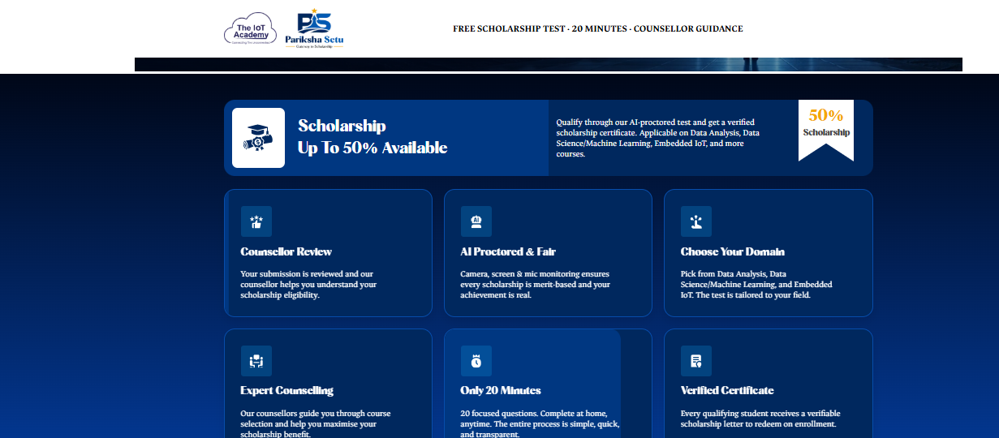

**Pariksha Setu – Educational Landing Page**

Developed a fully responsive educational landing page named **Pariksha Setu** by converting an exact **Figma design** into a pixel-perfect web interface using **HTML5, CSS3, Bootstrap 5, and JavaScript**. Implemented responsive layouts with Bootstrap's grid system, reusable UI components, custom styling, and interactive JavaScript functionality. Ensured cross-browser compatibility, mobile responsiveness, clean code structure, and accurate spacing, typography, colors, and visual hierarchy to match the original Figma design.

**Technologies Used:** HTML5, CSS3, Bootstrap 5, JavaScript, Figma

**Key Features:**

- Pixel-perfect Figma to HTML conversion.
- Fully responsive design for desktop, tablet, and mobile devices.
- Bootstrap Grid and Flexbox based layouts.
- Reusable and well-structured components.
- Interactive UI elements using JavaScript.
- Optimized images and clean semantic HTML.
- Cross-browser compatible and performance-focused implementation.
  **Screenshots **
 

  
  

